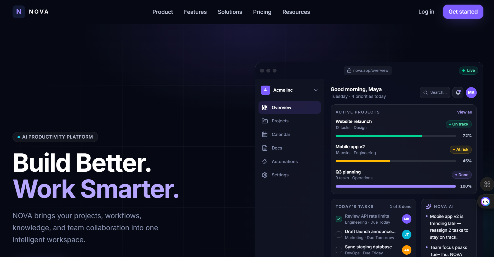
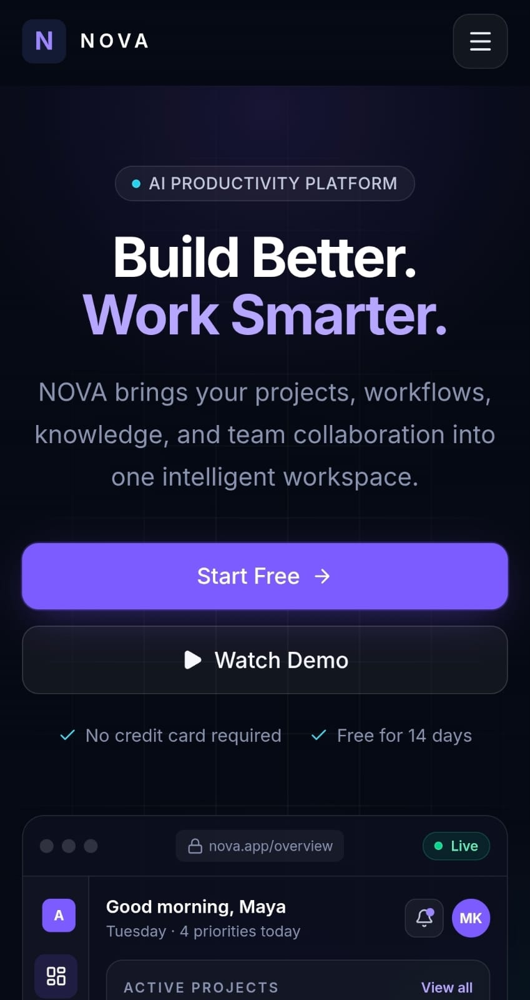
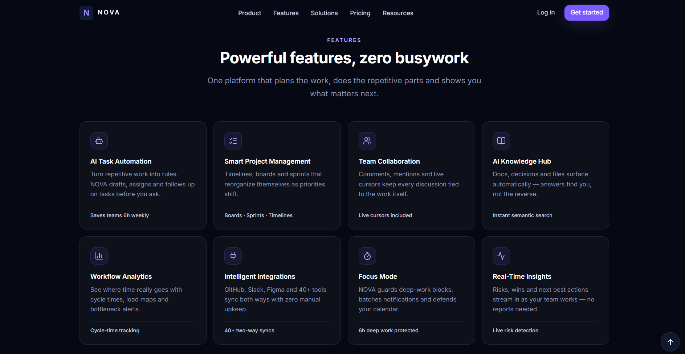
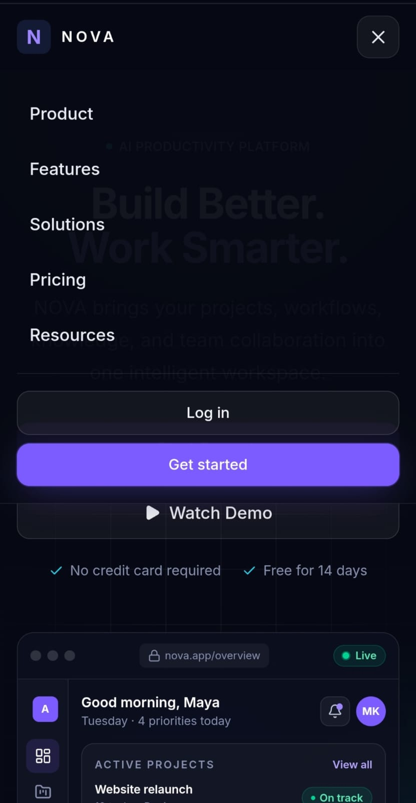
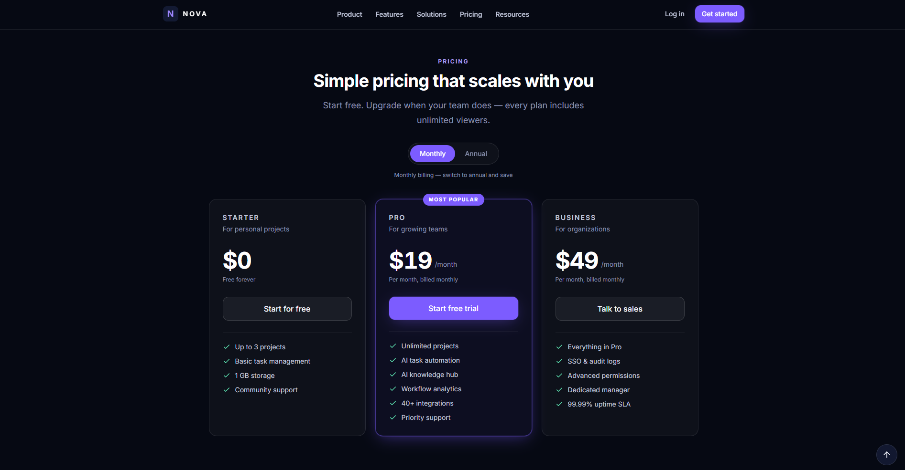
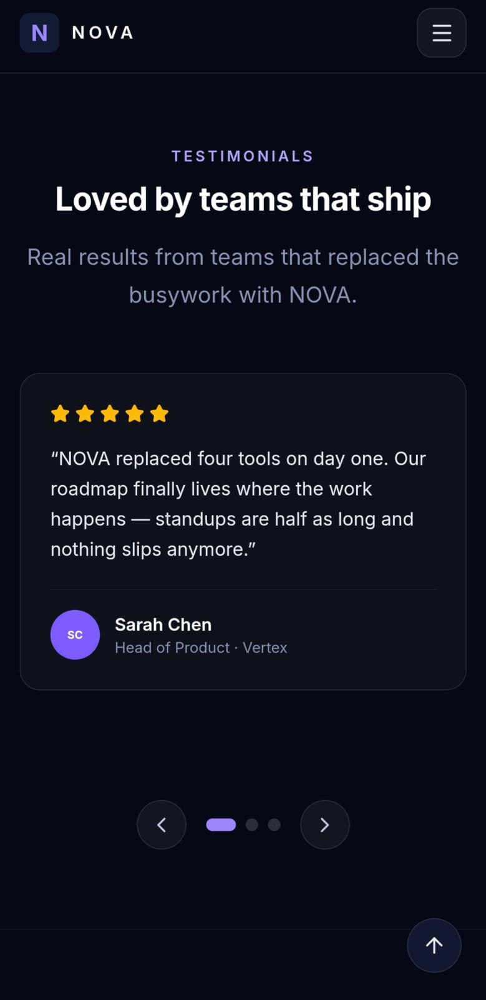

# NOVA — AI Productivity Platform

## Project Description

NOVA is a fictional AI-powered productivity SaaS platform designed to help teams manage projects, automate repetitive tasks, organize knowledge, and collaborate efficiently. The landing page demonstrates a modern, responsive, and accessible marketing website for this product.

Built as an internship assignment submission showcasing front-end development, UI/UX, responsive design, and component architecture skills.

## Technologies

* **React 19** — UI library
* **Vite 8** — Build tool and dev server
* **Tailwind CSS 4** — Utility-first CSS framework (CSS-first config via `@theme`)
* **Motion for React (Framer Motion 13)** — Animation library
* **Lenis 1** — Smooth scrolling
* **Lucide React** — Icon system

## Features

### Required Sections (13 total)
1. **Navigation Bar** — Fixed header with desktop links, mobile hamburger menu, smooth scroll navigation
2. **Hero** — Headline, dual CTAs, animated product dashboard mockup
3. **Trusted By** — 6 fictional company wordmarks with hover states
4. **Features** — 8 feature cards (AI Task Automation, Smart Project Management, Team Collaboration, AI Knowledge Hub, Workflow Analytics, Intelligent Integrations, Focus Mode, Real-Time Insights)
5. **Product/About** — Alternating layout with automation & alignment mockup panels
6. **How It Works** — 3-step connected timeline (horizontal desktop, vertical mobile)
7. **Statistics** — 4 animated counters (95% Less manual work, 40K+ Teams, 2.4M Tasks, 4.9/5 Rating)
8. **Solutions** — 4 solution cards (Startups, Product Teams, Marketing, Enterprise)
9. **Testimonials** — 3 testimonials (desktop grid, mobile carousel with keyboard navigation)
10. **Pricing** — 3 plans (Starter $0, Pro $19/$15, Business $49/$39) with Monthly/Annual toggle
11. **FAQ** — 7 accordion items with single-open behavior, keyboard accessible
12. **Final CTA** — Closing section with dual CTAs and trial microcopy
13. **Footer** — 4-column links, newsletter with validation, social icons, status indicator

### Required Interactions
- ✅ Responsive navigation (desktop + mobile hamburger)
- ✅ Mobile hamburger menu with focus trap and ESC close
- ✅ Smooth scrolling (Lenis) with header offset
- ✅ FAQ accordion (single-open, animated height, Plus→× rotation)
- ✅ Button hover/tap/focus states (primary, secondary, ghost)
- ✅ Card hover effects (lift, border transition, icon movement)
- ✅ Working navigation links (smooth scroll to sections)

### Bonus Features Implemented
- ✅ Back-to-top button (appears at 600px, smooth scroll, press animation)
- ✅ Demo modal (focus trap, ESC/overlay close, AnimatePresence transitions)
- ✅ Newsletter validation (client-side, regex, aria-live errors, success state)
- ✅ Reduced motion support (global + per-component)
- ✅ Scroll progress indicator (top bar, transform-based)

## Screenshots

| Desktop | Mobile |
|---------|--------|
|  |  |
|  |  |
|  |  |

## Installation

```bash
npm install
```

## Development

```bash
npm run dev
```

Opens at `http://localhost:5173` (or next available port).

## Production Build

```bash
npm run build
```

Outputs to `dist/` directory.

## Preview Production Build

```bash
npm run preview
```

## Live Demo

https://nova-ai-tawny-three.vercel.app

*Deployed on Vercel.*

## GitHub

https://github.com/1Manojkumar1/NOVA

## Project Structure

```
src/
├── components/           # Reusable UI primitives
│   ├── BackToTop.jsx     # Floating back-to-top button
│   ├── Badge.jsx         # Tag/badge with accent dot
│   ├── Button.jsx        # Primary/secondary/ghost, link or button
│   ├── Container.jsx     # Max-width wrapper with responsive padding
│   ├── DemoModal.jsx     # Accessible dialog with focus trap
│   ├── Navbar.jsx        # Fixed header, mobile menu, scroll progress
│   ├── SectionHeading.jsx # Eyebrow + H2 + description
│   ├── SocialIcons.jsx   # Inline SVG brand icons
│   └── index.js          # Barrel exports
├── data/                 # Content/data layer (single source of truth)
│   ├── dashboard.js      # Dashboard mockup data
│   ├── faqs.js           # FAQ Q&A pairs
│   ├── features.js       # 8 feature definitions
│   ├── footer.js         # Footer columns, socials, legal
│   ├── navigation.js     # Nav links, CTA hrefs
│   ├── pricing.js        # 3 plans with monthly/annual prices
│   ├── site.js           # Site name, tagline, description
│   ├── solutions.js      # 4 solution definitions
│   ├── stats.js          # 4 statistic definitions
│   └── testimonials.js   # 3 testimonial definitions
├── hooks/                # Reusable behavior
│   ├── useCountUp.js     # Viewport-triggered number animation
│   ├── useLenis.js       # Lenis singleton + scrollToHash helper
│   └── useScrolled.js    # Scroll threshold detector (rAF-throttled)
├── motion/               # Centralized animation system
│   ├── Reveal.jsx        # One-shot scroll reveal wrapper
│   └── variants.js       # Shared Motion variants & transitions
├── sections/             # Page sections (13 total)
│   ├── about/            # ProductAbout sub-components
│   ├── dashboard/        # Hero dashboard sub-components
│   ├── features/         # FeatureCard
│   ├── pricing/          # PricingCard
│   ├── solutions/        # SolutionCard
│   ├── stats/            # StatCard
│   ├── Faq.jsx
│   ├── Features.jsx
│   ├── FinalCta.jsx
│   ├── Footer.jsx
│   ├── Hero.jsx
│   ├── HowItWorks.jsx
│   ├── Pricing.jsx
│   ├── ProductAbout.jsx
│   ├── SectionStubs.jsx  # Placeholder anchors for unimplemented sections
│   ├── Solutions.jsx
│   ├── Statistics.jsx
│   ├── Testimonials.jsx
│   └── TrustedBy.jsx
├── utils/
│   └── cn.js             # Class name joiner (3-line utility)
├── App.jsx               # Root component, section composition
├── index.css             # Tailwind import + design tokens (@theme)
└── main.jsx              # Entry point
```

## Component Architecture

### Reusable Components
Primitives in `components/` are dumb presentational components:
- **Button** — handles `href` (renders `<a>`) or `onClick` (renders `<button>`), 3 variants, 3 sizes
- **Container** — consistent max-width (`max-w-7xl`) and responsive padding
- **SectionHeading** — eyebrow/H2/description with center/left alignment
- **Badge** — tag with accent dot, used for eyebrows and stats
- **BackToTop** — self-contained scroll detector + smooth scroll
- **DemoModal** — accessible dialog with focus management

### Data-Driven Rendering
All repeated UI uses `.map()` over data arrays in `data/`:
- Features (8), Solutions (4), Testimonials (3), Pricing (3), FAQ (7), Statistics (4), Trusted By (6)
- Single source of truth — no duplicated JSX
- Easy to add/remove/reorder items

### State Management
- **Local component state** only — no global store needed
- `Navbar`: `open` (menu), `scrolled` (header style)
- `Pricing`: `billing` ("monthly" | "annual")
- `FAQ`: `openIndex` (single-open accordion)
- `Testimonials`: `[index, direction]` tuple for carousel
- `Footer`: `email` / `error` / `done` (newsletter)
- `App`: `demoOpen` (modal)
- `Hero`: `reduceMotion` (via hook)

## Animation System

### Motion for React
All animations use `@motionone/react` (Framer Motion compatible API):
- **Variants** in `motion/variants.js` — single source for easing, durations, stagger
- **Reveal** wrapper (`motion/Reveal.jsx`) — one-shot `whileInView` for section headers
- **Scroll animations** — `whileInView` with `once: true`, conservative margins (-60px to -80px)
- **Hover interactions** — `whileHover` with `hoverLift` (y: -4, scale: 1.015)
- **AnimatePresence** — modal overlay/panel, testimonial carousel, FAQ panels, pricing badge

### Reduced Motion
- Global: `<MotionConfig reducedMotion="user">` in `App.jsx`
- Per-component: `useReducedMotion()` hook gates infinite animations (Hero glow, Dashboard Live badge)
- CSS: `@media (prefers-reduced-motion: reduce)` disables transitions/animations

### Performance
- Transform + opacity only (no layout triggers)
- `viewport once: true` prevents re-triggering
- Conservative spring configs (stiffness 400, damping 32 for billing pill)
- No parallax, particles, or scroll-linked transforms

## Responsive Design

### Breakpoints (Tailwind defaults)
- **Mobile**: `< 640px` — stacked layouts, full-width buttons, carousel for testimonials
- **Tablet**: `640px–1023px` — 2-column grids, sidebar collapses to icons
- **Desktop**: `1024px–1279px` — 3-4 column grids, full sidebar
- **Large**: `1280px–1535px` — expanded gaps, wider containers
- **XL**: `≥1536px` — max-width container, extra whitespace

### Key Patterns
- **Grid**: `grid-cols-1 sm:grid-cols-2 lg:grid-cols-3 xl:grid-cols-4`
- **Flex**: `flex-col sm:flex-row` for button groups
- **Typography**: Fluid `clamp()` in `@theme` (`text-hero`, `text-display`, `text-h1`, `text-h2`)
- **Container**: `max-w-7xl` with `px-4 sm:px-6 lg:px-8`
- **Dashboard**: `w-12` icon rail on mobile → `w-44` labeled sidebar on desktop

### Testing Checklist
- ✅ 375px (iPhone SE)
- ✅ 390px (iPhone 12/13/14)
- ✅ 480px (small Android)
- ✅ 768px (iPad)
- ✅ 1024px (iPad Pro / small laptop)
- ✅ 1280px (standard desktop)
- ✅ 1440px (large desktop)

No horizontal scroll, no clipped text, no overlapping elements at any breakpoint.

## Accessibility

### Semantic HTML
- Landmarks: `<header>`, `<nav>`, `<main>`, `<section>`, `<footer>`
- Heading hierarchy: `h1` (Hero) → `h2` (SectionHeading) → `h3` (Card titles)
- Lists: `<ul>`/`<ol>` for nav, features, solutions, testimonials, FAQ

### Keyboard Navigation
- All interactive elements are native `<button>` or `<a>`
- Focus order matches visual order
- Skip link to `#main` content
- `Tab`/`Shift+Tab` works in modal, carousel, mobile menu, FAQ

### ARIA
- `aria-expanded` / `aria-controls` on Navbar, FAQ, Pricing toggle
- `role="dialog"` / `aria-modal` / `aria-labelledby` on DemoModal
- `role="radiogroup"` / `role="radio"` / `aria-checked` on Pricing toggle
- `role="region"` / `aria-label` on Testimonials carousel
- `aria-live="polite"` on pricing caption, carousel, newsletter errors
- `role="status"` on newsletter success message
- `aria-roledescription` removed from carousel (non-standard)

### Focus States
- Global `:focus-visible` in CSS (2px brand ring, 3px offset)
- Visible on all buttons, links, form inputs, carousel controls
- Focus trap in DemoModal (restores on close)
- Focus return to trigger button (Navbar, DemoModal)

### Contrast
- Dark-first design: `ink-950` background, `mist-100`/`white` text
- Brand violet (`brand-400`/`500`) meets WCAG AA on dark
- Accent cyan (`accent-400`) used sparingly for indicators only

### Reduced Motion
- All animations respect `prefers-reduced-motion`
- Infinite loops (Hero glow, Dashboard Live badge) gated
- Count-up animations jump to final value
- Carousel transitions instant
- FAQ height animation instant

## Performance

### Optimized Animations
- Transform + opacity only (compositor-friendly)
- `will-change` not needed (short-lived animations)
- `viewport once: true` — observers disconnect after trigger
- No layout thrashing (no width/height/top/left animation)

### Minimal Dependencies
- 6 production deps (React, Motion, Lenis, Lucide, Tailwind)
- No UI kits, no date libraries, no state managers
- Tree-shaking works (ESM, named exports)

### Responsive Assets
- No images — all UI is CSS/SVG
- Icons: inline SVG (Lucide + custom SocialIcons)
- Fonts: Inter via Google Fonts with `preconnect`

### Avoiding Unnecessary Renders
- Components are pure presentational (props in, UI out)
- No context, no memo needed at this scale
- `useLenis` singleton avoids re-instantiation
- Data arrays in separate modules (imported once)

## AI Tools Used

AI tools were used for:
- **Brainstorming** — initial component breakdown, section planning
- **Implementation assistance** — writing boilerplate, Motion variants, Tailwind classes
- **Debugging** — Lenis integration, SSR config, build errors
- **Code review** — accessibility audit, performance analysis, architecture suggestions
- **Refinement** — animation timing, responsive breakpoints, code organization

All code was **reviewed, understood, and validated** by the developer. No blind copy-paste.

## Challenges Faced

1. **Responsive Dashboard UI** — Building a realistic product mockup that works at 375px and 1440px required careful `min-w-0`, `truncate`, and breakpoint-specific column logic.

2. **Navigation State** — Coordinating Lenis smooth scroll, mobile menu focus trap, scroll lock, and header style changes across resize/ESC/click required multiple `useEffect` with proper cleanup.

3. **Pricing State** — Monthly/Annual toggle drives price, caption, savings badge, and card hover styles across 3 cards; keeping derived values in sync without duplication.

4. **FAQ State** — Single-open accordion with animated height (`0` → `auto`) and Plus→× rotation; ensuring only one open while preserving keyboard access.

5. **Animation Coordination** — Centralizing 50+ animation configs into `motion/variants.js` without losing section-specific timing; Hero stagger vs. section reveals vs. card hover.

6. **Responsive Behavior** — Testing 7 breakpoints manually; fixing grid collapses, sidebar transitions, carousel↔grid switch, and footer column reflow.

---

## Deployment Checklist

- [x] `npm run build` — passes
- [x] `npm run preview` — serves correctly
- [x] No console errors in dev or preview
- [x] All 13 sections present
- [x] All required interactions work
- [x] SEO metadata (title, description, OG, Twitter)
- [x] README.md created
- [x] INTERVIEW_NOTES.md created
- [x] Push to GitHub
- [x] Connect to Vercel
- [x] Deploy and verify live URL
- [x] Update README with real URLs
- [x] Add screenshots

---

## Final Status

| Item | Status |
|------|--------|
| Production build | ✅ Passing |
| Preview server | ✅ Running |
| Console errors | ✅ None |
| 13 sections | ✅ All present |
| Features (≥6) | ✅ 8 |
| Testimonials (≥3) | ✅ 3 |
| Pricing (≥3) | ✅ 3 |
| FAQ (≥5) | ✅ 7 |
| Responsive (7 breakpoints) | ✅ Verified |
| Accessibility | ✅ Audited |
| Animation system | ✅ Unified |
| README.md | ✅ Created |
| INTERVIEW_NOTES.md | ✅ Created |

**Ready for GitHub + Vercel deployment.**